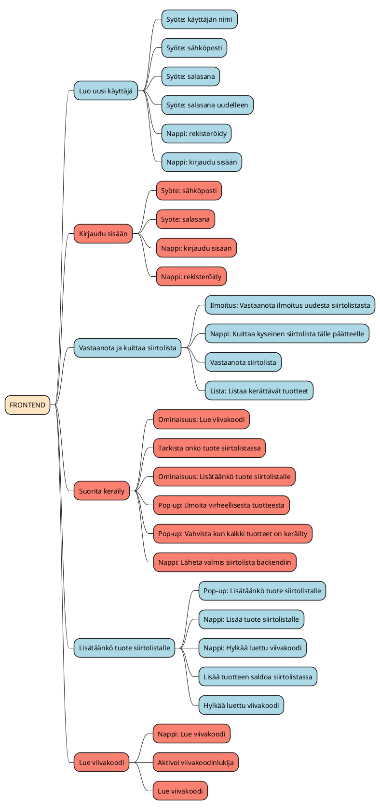
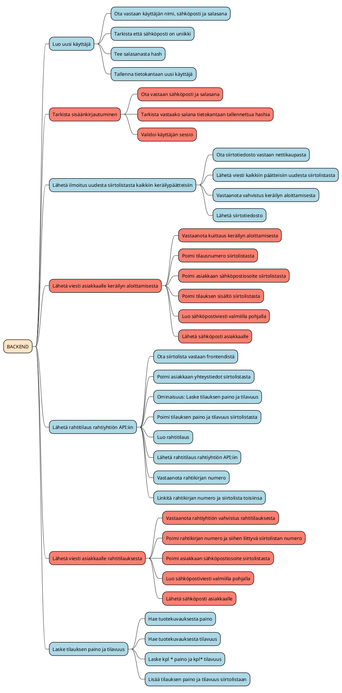

# Vaatimusmäärittely

# Johdanto

Tämä vaatimusmäärittely kuvailee mobiilisovelluksen ominaisuuksia ja toimintoja, joka auttaa keräämään tilauksia ja hallinnoimaan keräilyn prosessia. Sovelluksen tarkoituksena on helpottaa tilausten keräilyprosessia, vähentää virheitä ja parantaa tehokkuutta.

# Kohderyhmä

Sovellus on tarkoitettu käytettäväksi logistiikka-alan ammattilaisille ja henkilöille, jotka ovat vastuussa tilausten keräämisestä ja hallinnasta. / Sovelluksen kohderyhmä on varastonhoitohenkilökunta ja logistiikkatyöntekijät. He käyttävät sovellusta päivittäisessä työssään keräillessään tuotteita ja varmistaessaan niiden oikean toimituksen asiakkaille.

# Sidosryhmäkartta

Sovellus liittyy kiinteästi varastonhallintaan ja logistiikkaan, joten sen sidosryhmäkartoissa ovat varastonhoitohenkilökunta, logistiikka- ja kuljetusyritykset sekä asiakkaat. / 
Asiakkaat: tilaavat tuotteita verkkokaupasta
Kerääjät: vastuussa tilausten keräämisestä
Kuljetusliikkeet: noutavat ja toimittavat tilaukset
Sovelluskehittäjät: vastuussa sovelluksen kehittämisestä ja ylläpidosta

# Palveluun liittyvät asiakaspolut

Sovelluksen käyttäjät aloittavat sovelluksen kirjautumalla sisään ja siirtymällä sen etusivulle. Siellä he voivat aloittaa uuden keräilytoimeksiannon, joka luo uuden keräilytehtävän. He voivat skannata tuotteen viivakoodin, tarkistaa sen tiedot ja merkitä sen kerätyksi.

Tilauksen kerääminen: kerääjä kirjautuu sisään sovellukseen, valitsee tilauksen, skannaa tuotteiden viivakoodit ja tallentaa keräilyn tuloksen.
Tilauksen kuittaaminen: kuljetusliike kirjautuu sisään sovellukseen, valitsee tilauksen, kirjaa tilauksen vastaanotetuksi ja tallentaa kuljetuksen tiedot.
Tilauksen seuranta: kerääjä tai kuljetusliike kirjautuu sisään sovellukseen, etsii tilauksen ja tarkistaa sen tilan.

# Palvelun ominaisuudet ja toiminnot

## Frontend

| **Ominaisuus** | **Ominaisuuteen liittyvät toiminnot** |
| -: | :- |
| **Luo uusi käyttäjä** | **Syöte:** Käyttäjän nimi |
| | **Syöte:** Sähköposti
| | **Syöte:** Salasana |
| | **Syöte:** Salasana uudelleen |
| | **Nappi:** Rekisteröidy |
| | **Nappi:** Kirjaudu sisään |
| **Kirjaudu sisään** | **Syöte:** Sähköposti |
| | **Syöte:** Salasana |
| | **Nappi:** Kirjaudu sisään |
| | **Nappi:** Rekisteröidy |
| **Perusnäkymä** | **Ominaisuus:** Hae backendistä siirtolistat |
| | **Lista:** Avoimet siirtolistat<ul><li>**Nappi:** Valitse siirtolista</li></ul> |
| | Vastaanota siirtolista |
| | **Nappi / Ominaisuus:** Asetukset |
| | **Nappi:** Kirjaudu ulos |
| **Keräilynäkymä** | **Nappi:** Keskeytä keräily |
| | **Lista:** Valitun siirtolistan tuotteet<ul><li>**Lista:** Tuotteiden hyllypaikat (jokaiseen tuotteeseen)</li><li>**Nappi:** Tuotetta ei löydy varastosta (jokaiseen tuotteeseen)</li></ul> |
| | **Ominaisuus:** Lue viivakoodi |
| | Tarkista onko tuote siirtolistassa |
| | **Pop-up:** Kaikki tuotteet keräilty<ul><li>**Nappi:** Lähetä valmis siirtolista backendiin</li></ul> |
| **Asetukset näkymä** | **Syöte:** Kirjoita uusi salasana |
| | **Syöte:** Kirjoita uusi salasana uudelleen |
| | **Nappi:** Vaihda salasana |
| | **Dropdown menu:** Valitse kieli 1. Suomi, 2.Englanti, 3. Ruotsi |
| | **Nappi on/off: Pop-up:** Kaikki tuotteet keräilty |
| | **Nappi on/off: Pop-up:** Ilmoita virheellisestä tuotteesta |
| | **Nappi on/off: Pop-up:** Tuote lisätty siirtolistalle |
| | **Nappi on/off: Pop-up:** Lisätäänkö tuote siirtolistaan? |
| **Lue viivakoodi** | **Nappi:** Lue viivakoodi |
| | Aktivoi viivakoodinlukija |
| | Lue viivakoodi |
 

### Frontend MindMap muodossa

## Backend

| **Ominaisuus** | **Ominaisuuteen liittyvät toiminnot** |
| -: | :- |
| **Luo uusi käyttäjä** | Ota vastaan käyttäjän nimi, sähköposti ja salasana |
| | Tarkista että sähköposti on uniikki |
| | Tee salasanasta hash |
| | Tallenna tietokantaan uusi käyttäjä |
| **Tarkista sisäänkirjautuminen** | Ota vastaan sähköposti ja salasana |
| | Tarkista vastaako salana tietokantaan tallennettua hashia |
| | Validoi käyttäjän sessio |
| **Lähetä ilmoitus uudesta siirtolistasta kaikkiin keräilypäätteisiin** | Ota siirtotiedosto vastaan nettikaupasta |
| | Lähetä viesti kaikkiin päätteisiin uudesta siirtolistasta |
| | Vastaanota vahvistus keräilyn aloittamisesta |
| | Lähetä siirtotiedosto |
| **Lähetä viesti asiakkaalle keräilyn aloittamisesta** | Vastaanota kuittaus keräilyn aloittamisesta |
| | Poimi tilausnumero siirtolistasta |
| | Poimi asiakkaan sähköpostiosoite siirtolistasta |
| | Poimi tilauksen sisältö siirtolistasta |
| | Luo sähköpostiviesti valmiilla pohjalla |
| | Lähetä sähköposti asiakkaalle |
| **Lähetä rahtitilaus rahtiyhtiön API:iin** | Ota siirtolista vastaan frontendistä |
| | Poimi asiakkaan yhteystiedot siirtolistasta |
| | Ominaisuus: Laske tilauksen paino ja tilavuus |
| | Poimi tilauksen paino ja tilavuus siirtolistasta |
| | Luo rahtitilaus |
| | Lähetä rahtitilaus rahtiyhtiön API:iin |
| | Vastaanota rahtikirjan numero |
| | Linkitä rahtikirjan numero ja siirtolista toisiinsa |
| **Lähetä viesti asiakkaalle rahtitilauksesta** | Vastaanota rahtiyhtiön vahvistus rahtitilauksesta |
| | Poimi rahtikirjan numero ja siihen liittyvä siirtolistan numero |
| | Poimi asiakkaan sähköpostiosoite siirtolistasta |
| | Luo sähköpostiviesti valmiilla pohjalla |
| | Lähetä sähköposti asiakkaalle |
| **Laske tilauksen paino ja tilavuus** | Hae tuotekuvauksesta paino |
| | Hae tuotekuvauksesta tilavuus |
| | Laske kpl * paino ja kpl* tilavuus |
| | Lisää tilauksen paino ja tilavuus siirtolistaan |
 

### Frontend MindMap muodossa

# Toiminnalliset vaatimukset

Sovelluksen tulee toimia sujuvasti ja virheettömästi
Sovelluksen tulee olla yhteensopiva eri mobiilialustojen kanssa
Sovelluksen tulee pystyä synkronoimaan tietoja muiden järjestelmien kanssa
Sovelluksen tulee käyttää turvallista kirjautumista ja tietojen tallennusta
Kirjautuminen järjestelmään
Keräilytehtävän luominen
Tuotetietojen näyttäminen
Tuotteen skannaaminen
Keräilyn tilan seuranta
Tilauksen kuitkaus kuljetusliikkeelle

Kirjautuminen: Käyttäjän on voitava kirjautua sisään sovellukseen käyttäjätunnuksella ja salasanalla.
Tilausten luominen: Käyttäjä voi luoda uuden tilauksen syöttämällä tuotetietoja ja määrän. Tilaukseen voi liittää myös toimitusosoitteen ja maksutiedot.

Tilauksen muokkaaminen: Käyttäjä voi muokata luomaansa tilausta, esimerkiksi lisäämällä tai poistamalla tuotteita tai muuttamalla toimitusosoitetta.

Tilausten tarkastelu: Käyttäjä voi tarkastella luomiaan tilauksia ja niiden tilaa (esim. "vahvistettu", "lähetetty").

Tilausten poistaminen: Käyttäjä voi poistaa tilauksen, jos se ei ole vielä vahvistettu.

Tilauksen maksaminen: Käyttäjä voi maksaa tilauksen sovelluksen kautta.

Ostosten tallentaminen: Käyttäjä voi tallentaa suosikkituotteitaan sovellukseen, jolloin niitä ei tarvitse etsiä uudelleen jokaisen tilauksen yhteydessä.

Asiakaspalvelun yhteydenotto: Käyttäjä voi ottaa yhteyttä asiakaspalveluun chatin tai sähköpostin välityksellä.

# Käyttöliittymänäkymä

Kirjautumisnäkymä
Etusivu
Keräilynäkymä
Tuotetietojen näyttö
Tilauksen kuitkausnäkymä

Kirjautumisnäkymä: Käyttäjä syöttää kirjautumistietonsa ja pääsee sen jälkeen etusivulle.

Etusivu: Käyttäjä näkee suosituimmat tuotteet, viimeisimmät tarjoukset ja pääsee luomaan uuden tilauksen.

Tilauksen luomisen näkymä: Käyttäjä syöttää tilauksen tiedot (tuotteet, määrät, toimitusosoite, maksutiedot).

Tilauksen tarkastelunäkymä: Käyttäjä näkee tilauksen tiedot ja tilan.

Suosikit-näkymä: Käyttäjä näkee tallentamansa suosikkituotteet.

Asiakaspalvelun chat-näkymä: Käyttäjä voi lähettää viestejä asiakaspalveluun.

Asiakaspalvelun sähköpostilomake: Käyttäjä voi täyttää lomakkeen ja lähettää viestin asiakaspalveluun.

# Ketterän kehittämisen käyttötarinat

Käyttäjänä haluan voida kirjautua sovellukseen, jotta voin aloittaa keräilyn.
Käyttäjänä haluan voida luoda uuden keräilytehtävän, jotta voin aloittaa keräilyn.
Käyttäjänä haluan voida skannata tuotteen viivakoodin, jotta voin varmistaa keräilyn oikeellisuuden.
Käyttäjänä haluan voida seurata keräilyn tilaa, jotta voin varmistaa sen onnistuneen suorittamisen.
Käyttäjänä haluan voida kuitata tilauksen kuljetusliikkeelle

Sprinttien suunnittelu ja toteutus: Jokaisessa sprintissä sovitaan kehitettävistä ominaisuuksista, priorisoidaan tehtävät ja jaetaan työt kehittäjien kesken. 

Tämän jälkeen kehittäjät toteuttavat sovitut tehtävät tiimin sisäisissä palavereissa.

Asiakaspalautteen kerääminen: Kehitystiimi kerää jatkuvasti asiakaspalautetta kehitettävästä sovelluksesta. Palautetta käytetään hyväksi sprinttien suunnittelussa ja sovelluksen kehitystyössä.

Tuotteen julkaisu: Kun sovelluksen kehitystyö on valmis, tuote julkaistaan. 

Julkaisun yhteydessä tarkistetaan, että sovellus täyttää kaikki sille asetetut vaatimukset ja että se toimii virheettömästi.

Käyttöönotto: Sovelluksen käyttöönotossa huolehditaan siitä, että käyttäjät saavat riittävästi ohjeistusta ja tukea sovelluksen käyttöön. 

Käyttöönotossa huomioidaan myös tarvittavat integraatiot ja käyttöliittymien yhteensopivuus.

Ylläpito: Sovelluksen julkaisun jälkeen sen ylläpito on tärkeä osa kehitystyötä. 

Kehitystiimi vastaa sovelluksen päivityksistä ja huolehtii, että sovellus pysyy turvallisena ja toimii virheettömästi.

Jatkuva kehittäminen: Ketterän kehityksen periaatteisiin kuuluu jatkuva kehittäminen ja parantaminen. 

Kehitystiimi seuraa jatkuvasti sovelluksen käyttöä ja kerää palautetta käyttäjiltä. 

Palautteen perusteella sovellusta kehitetään edelleen ja pyritään parantamaan sen toimivuutta ja käyttökokemusta.

# Palveluun liittyvät tekniset vaatimukset:

Käyttöjärjestelmätuki: Android-käyttöjärjestelmäversiot 5.0 ja uudemmat.

Kehitystyökalut: Kotlin-ohjelmointikieli, Android Studio kehitysympäristö.

Tietokanta: ?

Ulkoiset rajapinnat: Mahdollisuus käyttää REST-rajapintoja verkkopalveluiden käyttämiseen.

Käyttöliittymäsuunnittelu: Käyttöliittymäsuunnittelu toteutetaan Material Design -ohjeiden mukaisesti.

Dokumentaatio: Palvelun tulee sisältää kattava dokumentaatio, joka sisältää käyttöohjeet, tekniset tiedot ja sovelluksen arkkitehtuurikuvauksen.

Palvelun tulee myös täyttää Android-sovelluksille asetetut turvavaatimukset, kuten käyttäjätietojen suojaus ja tietojen salaus. 
Palvelun tulee myös olla skaalautuva ja kykenevä käsittelemään suuria datamääriä.
