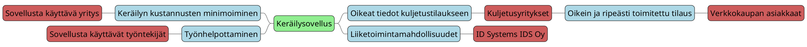
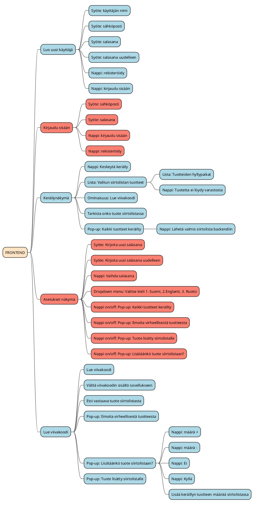
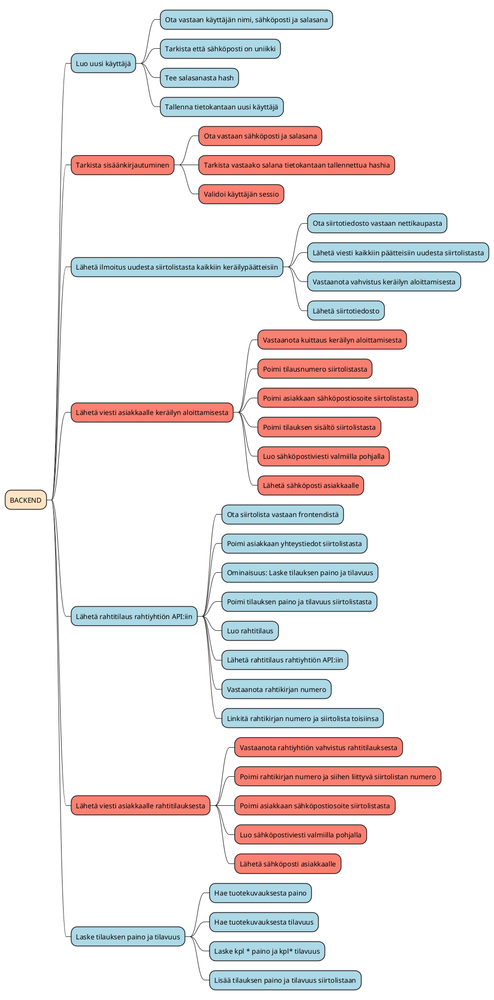

# Vaatimusmäärittely

# Johdanto

Tässä vaatimusmäärittelyssä kuvataan verkkokaupan keräilysovellus.

Sovellus on tarkoitettu matalan kynnyksen keräilysovellukseksi verkkokauppaliiketoiminnan aloittaville yrityksille.

Tavoitteena on tehdä sovellus, joka on helppokäyttöinen ja integroitavissa toimimaan erilaisten verkkokauppa-alustojen sekä varastokirjanpitojärjestelmien kanssa. 

Sovellus suunnitellaan toimimaan Android ympäristössä, jolloin sitä voidaan käyttää Zebra Technologiesin toimittamilla viivakoodinlukijoilla.

Sovelluksen tarkoituksena on helpottaa tilausten keräilyprosessia, vähentää virheitä ja parantaa tehokkuutta.

# Kaupallinen kohderyhmä

Sovellukella halutaan palvella verkkokauppaliiketoimintaa aloittavien yritysten tarpeita. Yritykset ovat todennäköisesti kohtalaisen pieniä ja mahdollisesti liiketoimintansa digitalisoinnin kanssa alkuvaiheessa.

Näille toimijoille tärkeää on että sovellus on integroitavissa heidän olemassa olevaan verkkokauppaansa sekä varastonhallintajärjestelmään. Helppokäyttöisyys, nopeus ja toimintavarmuus ovat heille tärkeitä. Erityisesti digitalisoinnin kanssa alkuvaiheessa olevilla yrityksillä on varmasti tarvetta myös konsuntoivalle myynnille, koska kokemuksen mukanaan tuomaa ymmärrystä tarvittavista prosesseista ei ole muodostunut.

# Käyttäjärajapinnan kohderyhmät

Verkkoliiketoiminnan alkuvaiheessa sovelluksen käyttäjät ovat luultavasti varastohenkilökuntaa. Pienissä yrityksissä, joissa ei ole erillistä varastohenkilökuntaa, käyttäjänä voivat olla esimerkiksi myyjät. Verkkokauppaliiketoiminnan kehityttyä riittävän isoksi, keräilyyn palkattaneen oma erikoistunut työvoimansa.

Kohderyhmässä huomioitavia asioita ovat:

- käyttäjät eivät ole teknisesti koulutettuja, joten sovelluksen käyttöliittymän tulee olla yksinkertainen ja intuitiivinen
- käyttäjissä voi olla paljon maahanmuuttajia, joten ainakin englannin kielen lisääminen lienee tarpeellista

# Sidosryhmät

Sovellus auttaa tilauksen keräilystä vastaavia henkilöitä tekemään työnsä. Tällä työllä he palvelevat tilauksen tehneitä asiakkaita, varmistaen että tilaukset toimitetaan ripeästi, varmasti ja oikein.

Sovelluksen hankkinut yritys on myös sidosryhmä. Yrityksen kannalta kyse on asiakaspalvelun varmistamisesta, työntekijöiden resursoinnista ja keräilyn kustannuksen minimoinnista sekä laadun maksinoinnista.

Kolmas merkittävä sidosryhmä ovat kuljetusyritykset, joiden kuljetuspalveluita tilataan sovelluksen tuottaman tiedon pohjalta.

Neljäntenä sidosryhmänä on ID Systems IDS Oy, jonka tuotekatalogiin sovellus tulee.

Viides sidosryhmä ovat verkkokaupan asiakkaat, joiden tilaus keräillään sovelluksella.

# Sidosryhmäkartta



<br>

# Palveluun liittyvät asiakaspolut

```plantuml
state Askel1 #LawnGreen
state Askel2 #LawnGreen
state Askel3 #LawnGreen
state Askel4 #LawnGreen
state Askel5 #LawnGreen
state Askel6 #Red
state Askel7 #LawnGreen
state Askel8 #LawnGreen
state Askel9 #LawnGreen
state Exit #LawnGreen
Askel1: Keräilijä kirjautuu sovellukseen
Askel2: Keräilijä valitsee keräiltävän tilauksen
Askel3: Keräilijä lukee viivakoodin
Askel4: Keräilijä kuittaa tuotteen ja määrän
Askel5: Kaikki tuotteet keräilty
Askel6: Luettua viivakoodia ei löydy tilauksesta
Askel7: Tilauksen toimittaminen pakkaamoon
Askel8: Rahtitilaus keräillyille tuotteille
Askel9: Rahtiyhtiö noutaa tilauksen
Exit: Verkkokaupan asiakas saa tilauksensa

[*] --> Askel1
Askel1 -[#Green]-> Askel2
  Askel2 -[#Green]-> Askel3
    Askel3 -[#Green]-> Askel4
      Askel3 -[#Gold]-> Askel6
      Askel6 -[#Gold]-> Askel3
    Askel4 -[#Green]-> Askel3
      Askel4 -[#Green]-> Askel5                      
        Askel5 -[#Green]-> Askel7
        Askel5 -[#Green]-> Askel8
            Askel8 -[#Red]-> Askel9
            Askel7 -[#Red]-> Askel9
              Askel9 -[#Red]-> Exit
```

<br>

# Palvelun ominaisuudet ja toiminnot

## Frontend

| **Ominaisuus** | **Ominaisuuteen liittyvät toiminnot** |
| -: | :- |
| **Luo uusi käyttäjä** | **Syöte:** Käyttäjän nimi |
| | **Syöte:** Sähköposti
| | **Syöte:** Salasana |
| | **Syöte:** Salasana uudelleen |
| | **Nappi:** Rekisteröidy |
| | **Nappi:** Kirjaudu sisään |
| **Kirjaudu sisään** | **Syöte:** Sähköposti |
| | **Syöte:** Salasana |
| | **Nappi:** Kirjaudu sisään |
| | **Nappi:** Rekisteröidy |
| **Perusnäkymä** | **Ominaisuus:** Hae backendistä siirtolistat |
| | **Lista:** Avoimet siirtolistat<ul><li>**Nappi:** Valitse siirtolista</li></ul> |
| | Vastaanota siirtolista |
| | **Nappi / Ominaisuus:** Asetukset |
| | **Nappi:** Kirjaudu ulos |
| **Keräilynäkymä** | **Nappi:** Keskeytä keräily |
| | **Lista:** Valitun siirtolistan tuotteet<ul><li>**Lista:** Tuotteiden hyllypaikat (jokaiseen tuotteeseen)</li><li>**Nappi:** Tuotetta ei löydy varastosta (jokaiseen tuotteeseen)</li></ul> |
| | **Ominaisuus:** Lue viivakoodi |
| | Tarkista onko tuote siirtolistassa |
| | **Pop-up:** Kaikki tuotteet keräilty<ul><li>**Nappi:** Lähetä valmis siirtolista backendiin</li></ul> |
| **Asetukset näkymä** | **Syöte:** Kirjoita uusi salasana |
| | **Syöte:** Kirjoita uusi salasana uudelleen |
| | **Nappi:** Vaihda salasana |
| | **Dropdown menu:** Valitse kieli 1. Suomi, 2.Englanti, 3. Ruotsi |
| | **Nappi on/off: Pop-up:** Kaikki tuotteet keräilty |
| | **Nappi on/off: Pop-up:** Ilmoita virheellisestä tuotteesta |
| | **Nappi on/off: Pop-up:** Tuote lisätty siirtolistalle |
| | **Nappi on/off: Pop-up:** Lisätäänkö tuote siirtolistaan? |
| **Lue viivakoodi** | **Nappi:** Lue viivakoodi |
| | Välitä viivakoodin sisältö sovellukseen |
| | Etsi vastaava tuote siirtolistasta |
| | **Pop-up:** Ilmoita virheellisestä tuotteesta |
| | **Pop-up:** Lisätäänkö tuote siirtolistaan?<ul><li>**Nappi:** määrä +</li><li>**Nappi:** määrä -</li><li>**Nappi:** Ei</li><li>**Nappi:** Kyllä</li><li>Lisää keräillyn tuotteen määrää siirtolistassa</li></ul> |
| | **Pop-up:** Tuote lisätty siirtolistalle |
<br>

### Frontend MindMap muodossa



## Backend

| **Ominaisuus** | **Ominaisuuteen liittyvät toiminnot** |
| -: | :- |
| **Luo uusi käyttäjä** | Ota vastaan käyttäjän nimi, sähköposti ja salasana |
| | Tarkista että sähköposti on uniikki |
| | Tee salasanasta hash |
| | Tallenna tietokantaan uusi käyttäjä |
| **Tarkista sisäänkirjautuminen** | Ota vastaan sähköposti ja salasana |
| | Tarkista vastaako salana tietokantaan tallennettua hashia |
| | Validoi käyttäjän sessio |
| **Lähetä ilmoitus uudesta siirtolistasta kaikkiin keräilypäätteisiin** | Ota siirtotiedosto vastaan nettikaupasta |
| | Lähetä viesti kaikkiin päätteisiin uudesta siirtolistasta |
| | Vastaanota vahvistus keräilyn aloittamisesta |
| | Lähetä siirtolista |
| **Lähetä viesti asiakkaalle keräilyn aloittamisesta** | Vastaanota kuittaus keräilyn aloittamisesta |
| | Poimi tilausnumero siirtolistasta |
| | Poimi asiakkaan sähköpostiosoite siirtolistasta |
| | Poimi tilauksen sisältö siirtolistasta |
| | Luo sähköpostiviesti valmiilla pohjalla |
| | Lähetä sähköposti asiakkaalle |
| **Lähetä rahtitilaus rahtiyhtiön API:iin** | Ota siirtolista vastaan frontendistä |
| | Poimi asiakkaan yhteystiedot siirtolistasta |
| | Ominaisuus: Laske tilauksen paino ja tilavuus |
| | Poimi tilauksen paino ja tilavuus siirtolistasta |
| | Luo rahtitilaus |
| | Lähetä rahtitilaus rahtiyhtiön API:iin |
| | Vastaanota rahtikirjan numero |
| | Linkitä rahtikirjan numero ja siirtolista toisiinsa |
| **Lähetä viesti asiakkaalle rahtitilauksesta** | Vastaanota rahtiyhtiön vahvistus rahtitilauksesta |
| | Poimi rahtikirjan numero ja siihen liittyvä siirtolistan numero |
| | Poimi asiakkaan sähköpostiosoite siirtolistasta |
| | Luo sähköpostiviesti valmiilla pohjalla |
| | Lähetä sähköposti asiakkaalle |
| **Laske tilauksen paino ja tilavuus** | Hae tuotekuvauksesta paino |
| | Hae tuotekuvauksesta tilavuus |
| | Laske kpl * paino ja kpl* tilavuus |
| | Lisää tilauksen paino ja tilavuus siirtolistaan |
<br>

### Frontend MindMap muodossa




<br>

# Toiminnalliset vaatimukset

| Toiminnallisen vaatimuksen kuvaus | Toiminnallinen ominaisuus |
| -: | :- |
| Käyttäjä voi kirjautua henkilökortilla | [Kirjaudu sisään](#Frontend) |
| Käyttäjä voi kirjautua salasanalla ja | [Kirjaudu sisään](#Frontend) |
| Sovellus vastaanottaa xml-tiedoston verkkokaupasta | [Lähetä ilmoitus uudesta siirtolistasta kaikkiin keräilypäätteisiin](#backend) |
| Sovellus ilmoitta uudesta siirtolistasta | [Lähetä ilmoitus uudesta siirtolistasta kaikkiin keräilypäätteisiin](#backend) |
| Sovelluksella pitää voida kuitata siirtolista työnalle | [Perusnäkymä](#frontend) |
| Sovelluksella pitää voida keräillä tilaus | [Keräilynäkymä](#frontend) |
| Sovellus tuottaa keräilystä siirtotiedoston XML-muodossa | [Keräilynäkymä](#frontend) |
| Tuotteiden keräilyssä pitää käyttää viivakoodeja | [Lue viivakoodi](#frontend) |
| Sovelluksessa tulee olla mahdollisuus vaihtaa kieltä | [Asetukset näkymä](#frontend) |
| Salasana pitää voida vaihtaa | [Asetukset näkymä](#frontend) |
| Sovelluksen pop-upeille on/off vaihtoehto | [Asetukset näkymä](#frontend) |
| Keräily pitää voida keskeyttää | [Keräilynäkymä](#frontend) |
| Sovelluksen pitää kertoa keräiltävän tuotteen hyllypaikka | [Keräilynäkymä](#frontend) |
| Jos tuotetta ei löydy, siitä pitää voida ilmoittaa | [Keräilynäkymä](#frontend) |
| Sovelluksen pitää ilmoittaa jos viivakoodin tuotetta ei löydy siirtolistasta | [Lue viivakoodi](#frontend) |
| Sovelluksen tulee ilmoittaa kun kaikki tuotteet on keräilty | [Keräilynäkymä](#frontend) |
| Sovelluksen pitää lähettää tilaajalle viesti keräilyn aloittamisesta | [Lähetä viesti asiakkaalle keräilyn aloittamisesta](#backend) |
| Kun tilaus on keräilty, sovellus tilaa rahdin | [Lähetä rahtitilaus rahtiyhtiön API:iin](#backend) |
| Sovelluksen tulee lähettää tilaajalle viesti rahtitilauksesta | [Lähetä viesti asiakkaalle rahtitilauksesta](#backend) |
| Sovelluksen tulee nostaa keräämättömät tuotteet listauksen alkuun | [Keräilynäkymä](#frontend) |
| Sovelluksen tulee järjestää keräiltävät tuotteet hyllypaikan sijainnin mukaan | [Keräilynäkymä](#frontend) |

<br>

# Käyttöliittymänäkymä

Kirjautumisnäkymä
Etusivu
Keräilynäkymä
Tuotetietojen näyttö
Tilauksen kuitkausnäkymä

Kirjautumisnäkymä: Käyttäjä syöttää kirjautumistietonsa ja pääsee sen jälkeen etusivulle.

Etusivu: Käyttäjä näkee suosituimmat tuotteet, viimeisimmät tarjoukset ja pääsee luomaan uuden tilauksen.

Tilauksen luomisen näkymä: Käyttäjä syöttää tilauksen tiedot (tuotteet, määrät, toimitusosoite, maksutiedot).

Tilauksen tarkastelunäkymä: Käyttäjä näkee tilauksen tiedot ja tilan.

Suosikit-näkymä: Käyttäjä näkee tallentamansa suosikkituotteet.

Asiakaspalvelun chat-näkymä: Käyttäjä voi lähettää viestejä asiakaspalveluun.

Asiakaspalvelun sähköpostilomake: Käyttäjä voi täyttää lomakkeen ja lähettää viestin asiakaspalveluun.

# Ketterän kehittämisen käyttötarinat

Käyttäjänä haluan voida kirjautua sovellukseen, jotta voin aloittaa keräilyn.
Käyttäjänä haluan voida luoda uuden keräilytehtävän, jotta voin aloittaa keräilyn.
Käyttäjänä haluan voida skannata tuotteen viivakoodin, jotta voin varmistaa keräilyn oikeellisuuden.
Käyttäjänä haluan voida seurata keräilyn tilaa, jotta voin varmistaa sen onnistuneen suorittamisen.
Käyttäjänä haluan voida kuitata tilauksen kuljetusliikkeelle

Sprinttien suunnittelu ja toteutus: Jokaisessa sprintissä sovitaan kehitettävistä ominaisuuksista, priorisoidaan tehtävät ja jaetaan työt kehittäjien kesken. 

Tämän jälkeen kehittäjät toteuttavat sovitut tehtävät tiimin sisäisissä palavereissa.

Asiakaspalautteen kerääminen: Kehitystiimi kerää jatkuvasti asiakaspalautetta kehitettävästä sovelluksesta. Palautetta käytetään hyväksi sprinttien suunnittelussa ja sovelluksen kehitystyössä.

Tuotteen julkaisu: Kun sovelluksen kehitystyö on valmis, tuote julkaistaan. 

Julkaisun yhteydessä tarkistetaan, että sovellus täyttää kaikki sille asetetut vaatimukset ja että se toimii virheettömästi.

Käyttöönotto: Sovelluksen käyttöönotossa huolehditaan siitä, että käyttäjät saavat riittävästi ohjeistusta ja tukea sovelluksen käyttöön. 

Käyttöönotossa huomioidaan myös tarvittavat integraatiot ja käyttöliittymien yhteensopivuus.

Ylläpito: Sovelluksen julkaisun jälkeen sen ylläpito on tärkeä osa kehitystyötä. 

Kehitystiimi vastaa sovelluksen päivityksistä ja huolehtii, että sovellus pysyy turvallisena ja toimii virheettömästi.

Jatkuva kehittäminen: Ketterän kehityksen periaatteisiin kuuluu jatkuva kehittäminen ja parantaminen. 

Kehitystiimi seuraa jatkuvasti sovelluksen käyttöä ja kerää palautetta käyttäjiltä. 

Palautteen perusteella sovellusta kehitetään edelleen ja pyritään parantamaan sen toimivuutta ja käyttökokemusta.

# Tekniset vaatimukset

Käyttöjärjestelmätuki: Sovelluksen tulee toimia Android-ympäristössä. Sovellus tehdään ensisijaisesti Zebra Technologiesin viivakoodinlukijoille, joissa on tällä hetkellä Android 10 käyttöjärjestelmä.

Kehitystyökalut: Kotlin-ohjelmointikieli ja Android Studio kehitysympäristö tai React Native.

Tietokanta: Tietokanta tallennetaan ulkoiseen palveluun ja sitä käytetään REST-rajapinnan avulla. Käytettävä tietokantasovellus on valittavissa vapaasti.

Ulkoiset rajapinnat: Mahdollisuus käyttää REST-rajapintoja verkkopalveluiden käyttämiseen.

Käyttöliittymäsuunnittelu: Käyttöliittymäsuunnittelu toteutetaan Material Design -ohjeiden mukaisesti.

Dokumentaatio: Palvelun tulee sisältää kattava dokumentaatio, joka sisältää käyttöohjeet, tekniset tiedot ja sovelluksen arkkitehtuurikuvauksen.

Palvelun tulee myös täyttää Android-sovelluksille asetetut turvavaatimukset, kuten käyttäjätietojen suojaus ja tietojen salaus.

Palvelun tulee myös olla skaalautuva ja kykenevä käsittelemään suuria datamääriä.
